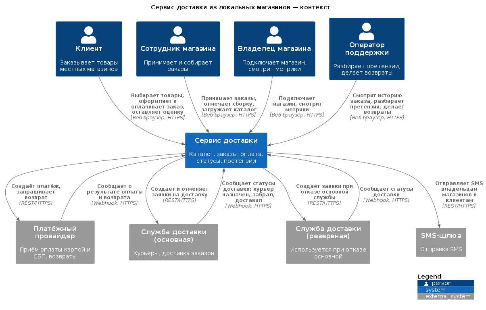
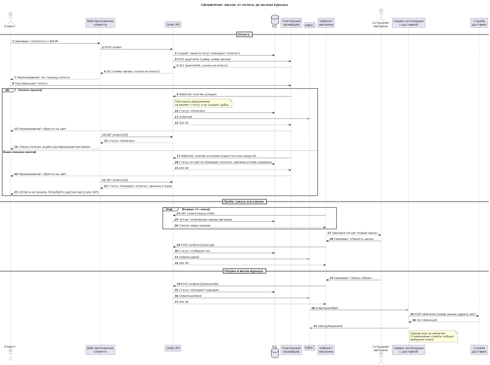
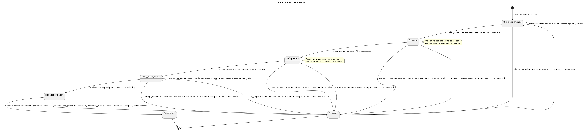
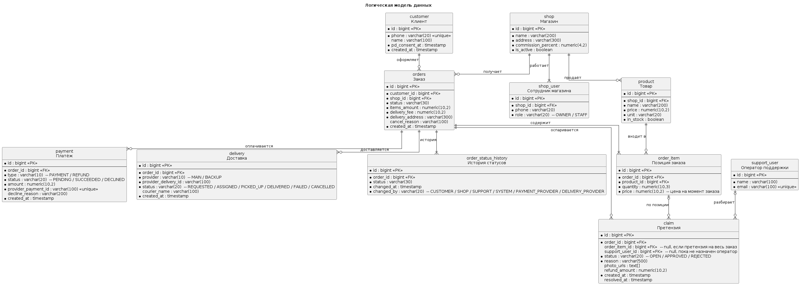

# SRS: Сервис доставки из локальных магазинов

| Параметр | Значение |
|---|---|
| Версия | 1.0 |
| Автор | Петрухин Максим |
| Дата | 10.10.2026 |
| Статус | Готов к ревью |

## 1. Введение

Документ описывает требования к MVP сервиса доставки товаров из локальных магазинов:
клиент заказывает товары онлайн, магазин собирает заказ, партнёрская служба доставки
привозит его в течение часа. Пилот — один район города.

## 2. Концепция и стейкхолдеры

- [Vision](vision.md) — проблема, цели, метрики успеха, границы MVP
- [Реестр стейкхолдеров](stakeholders.md) — интересы, влияние, конфликты, открытые вопросы

## 3. Архитектура

### 3.1. Контекст системы

### 3.2. Контейнеры

Исходный код диаграмм: [c4-context.puml](c4-context.puml), [c4-container.puml](c4-container.puml)

## 4. Функциональные требования

- [User stories и критерии приёмки](user-stories.md) — 15 историй по 8 эпикам, Gherkin для ключевых
- [UC-01. Оформить заказ](use-cases.md)

### 4.1. Процесс оформления заказа

### 4.2. Жизненный цикл заказа

## 5. Нефункциональные требования

- [NFR](nfr.md) — производительность, доступность, безопасность, интеграции, наблюдаемость

## 6. Модель данных

## 7. Интеграции

| Внешняя система | Направление | Способ | Что передаётся | Где описано |
|---|---|---|---|---|
| Платёжный провайдер | Мы → провайдер | REST | Создание платежа, возврат | US-15, NFR-04 |
| Платёжный провайдер | Провайдер → мы | Webhook | Результат оплаты и возврата | US-15 |
| Служба доставки (основная и резервная) | Мы → служба | REST | Создание и отмена заявки | US-16, NFR-02 |
| Служба доставки (основная и резервная) | Служба → мы | Webhook | Статусы доставки | US-16 |
| SMS-шлюз | Мы → шлюз | REST | SMS владельцам и клиентам | US-01, US-10 |

Детальные спецификации интеграций — в модуле 3.

## 8. Глоссарий

| Термин | Определение |
|---|---|
| Заказ | Набор товаров одного магазина, оформленный клиентом для доставки по одному адресу |
| Позиция заказа | Один товар в заказе с количеством и ценой на момент оформления |
| Автоотмена | Отмена заказа системой без участия человека по истечении норматива (оплаты, подтверждения, сборки) |
| Вебхук | Входящий HTTP-запрос от внешней системы с уведомлением о событии |
| Активный магазин | Магазин, получивший хотя бы один заказ за последние 30 дней |
| Норматив подтверждения | 10 минут с момента поступления оплаченного заказа в магазин |
| ... | ... |

## 9. Матрица трассировки

Показывает, как цели из Vision связаны с требованиями и проверками.

| Цель / метрика из Vision | User stories | Use case | NFR | Как проверяем |
|---|---|---|---|---|
| Доля отмен по вине магазина ≤ 5 % | US-10, US-01 | UC-01, исключение 12а | — | Gherkin US-10; метрика в отчёте |
| Время от заказа до доставки ≤ 60 мин | US-16, US-03 | UC-01 | NFR-02 | Расчёт по order_status_history |
| ... | | | | |
| ... | | | | |
| ... | | | | |

## 10. Открытые вопросы

Актуальный список — в разделе «Открытые вопросы» [реестра стейкхолдеров](stakeholders.md).