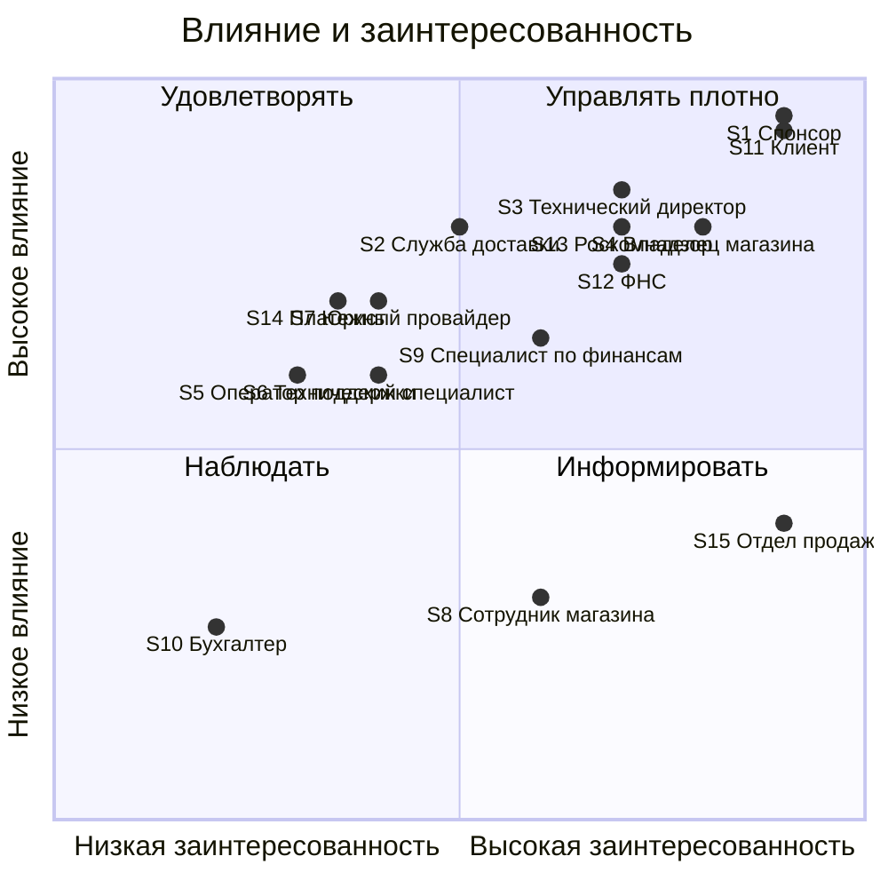

# Реестр стейкхолдеров: Сервис доставки из локальных магазинов

| Параметр | Значение |
|---|---|
| Версия | 0.2 |
| Автор | Петрухин Максим |
| Дата | 08.10.2026 |

## 1. Реестр

| № | Стейкхолдер | Тип | Интересы (что для него важно) | Влияние | Заинтересованность | Стратегия | Как вовлекаем |
|---|---|---|---|---|---|---|---|
| S1 | Спонсор проекта (CEO) | Внутренний | Окупаемость, выход на безубыточность за 9 мес., репутация компании | Высокое | Высокая | Управлять плотно | Демо раз в 2 недели, согласование скоупа и бюджета |
| S2 | Служба доставки (партнёр) | Внешний | Стабильный поток заказов, предсказуемая нагрузка, корректные адреса | Высокое | Средняя | Удовлетворять | Технические созвоны по API, согласование SLA, ежемесячный отчёт по объёмам |
| S3 | Технический директор (CTO) | Внутренний | Стабильная работа сервиса, постоянный онлайн, быстрые доработки| Высокое | Высокая | Управлять плотно | Сверка SLA, Демо раз в 2 недели, Формирование бэклога |
| S4 | Владелец магазина | Внешний | Выгодные условия (комиссия, сроки на сбор заказа), увеличение выручки| Высокое | Высокая | Управлять плотно | интервью перед стартом (проверить допущение про комиссию 15 %), ежемесячный отчёт о продажах, опрос удовлетворённости раз в квартал |
| S5 | Оператор поддержки | Внутренний | видеть всю историю заказа в одном окне, иметь право сделать возврат без согласования до N рублей, получать меньше обращений из-за понятных статусов | Среднее | Средняя | Удовлетворять | Демо раз в 2 недели |
| S6 | Технический специалист | Внутренний | бесшовное подключение магазина и службы доставки | Среднее | Средняя | Удовлетворять | дейли, демо раз в 2 недели, ретро каждые 2 недели |
| S7 | Юрист | Внутренний | Отсутствие юридических нарушений со стороны участников сервиса | Среднее | Средняя | Удовлетворять | согласование скоупа, консультации по мере поступления спорных случаев |
| S8 | Сотрудник магазина | Внешний | Быстрое выполнение заказа, своевременная передача в службу доставки | Низкое | Высокая | Информировать | Наблюдение за сборкой заказа в магазине до старта, юзабилити-тест кабинета, обучение перед запуском |
| S9 | Специалист по финансам | Внутренний | Контроль бюджета, финансового плана | Высокое | Средняя | Удовлетворять | Ежегодное формирование бюджета, ежеквартальный демо отчет |
| S10 | Бухгалтер | Внутренний | Проводки сведены | Низкое | Низкая | Наблюдать | ежемесячный отчёт |
| S11 | Клиент | Внешний | Быстрая доставка, актуальное наличие, понятная стоимость, лёгкий возврат денег за некачественный товар | Высокое | Высокая | Управлять плотно | Интервью до старта, юзабилити-тесты прототипа, анализ оценок и отзывов после запуска |
| S12 | ФНС | Внешний | Исполнение 54-ФЗ | Высокое | Средняя | Удовлетворять | Через юриста и финансы: выбрать схему фискализации, подключить онлайн-кассу или кассу платёжного провайдера, проверить чеки на тесте |
| S13 | Роскомнадзор | Внешний | Контроль за персональными данными клиентов по 152-ФЗ | Высокое | Средняя | Удовлетворять | Через юриста: уведомление об обработке персональных данных, политика конфиденциальности, согласие клиента при регистрации |
| S14 | Платежный провайдер | Внешний | Стабильное выполнение платежных операций | Высокое | Средняя | Удовлетворять | Технические созвоны по API, согласование SLA |
| S15 | Отдел продаж | Внутренний | Чем больше магазинов подключиться, тем лучше | Высокое | Высокая | Информировать | Отчет раз в месяц, согласование KPI |

## 2. Карта стейкхолдеров

## 3. Конфликты интересов

| Стейкхолдеры | Суть конфликта | Как разрешаем |
|---|---|---|
| Спонсор ↔ Владелец магазина | Спонсору нужна высокая комиссия, владельцу — низкая | Стартовая комиссия 10 % на первые 3 месяца для первых 50 магазинов, затем 15 %. Проверить допущение на интервью с владельцами |
| Технический директор ↔ Специалист по финансам | Техническому директору нужны траты на инфраструктуру, Специалист по финансам — низкие траты | Технический директор делает несколько вариантов бюджета по каждой статье: эконом, умеренная, макс|
|Клиент ↔ Магазин | клиент хочет получить заказ быстро, магазину нужно время на сборку|информирование клиента о нормативном времени исполнения заказа, магазину прописываем предельное время на сборку, иначе увеличенная комиссия|
|Магазин ↔ Служба доставки | курьер приезжает раньше, чем заказ собран, и ждёт. Кто платит за ожидание?|Вызывать курьера не в момент оплаты заказа, а когда магазин нажимает «Заказ собран» (или за N минут до окончания нормативного времени сборки). Курьер не приезжает раньше времени, ожидания нет. Повышенная комиссия — только если магазин превысил норматив|

## 4. Открытые вопросы

| № | Вопрос | Кому задать | Статус |
|---|---|---|---|
| Q1 | Кто формирует кассовый чек при онлайн-оплате: магазин или сервис? | Юрист, финансы | Открыт |
| Q2 | Кому передавать вопросы, если вышло за рамки 1 линии поддержки | Поддержка | Открыт |
| Q3 | Кто компенсирует возврат за некачественный товар: магазин или сервис? | CEO | Открыт |
| Q4 | Как часто и каким способом сервис перечисляет деньги магазинам за вычетом комиссии? | финансы | Открыт |
| Q5 | что делать с товарами, которые были в старом каталоге, но отсутствуют в новом файле? Удалять или ставить «нет в наличии»?| CEO | Открыт |
