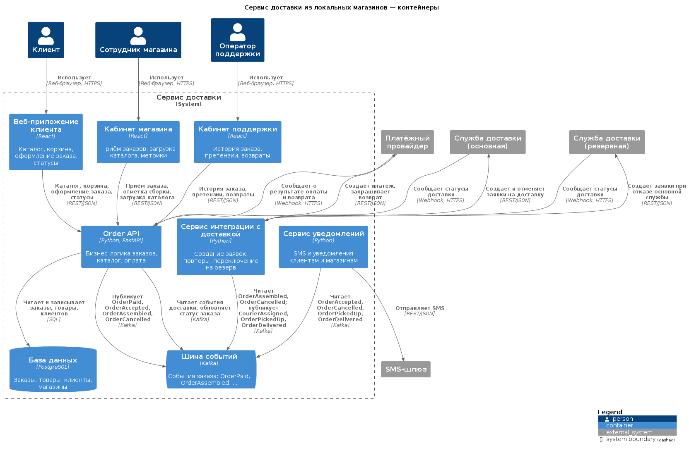

## Модуль 1. Требования и моделирование

Сквозной кейс: сервис доставки из локальных магазинов.
Главный документ — [SRS](01-requirements/srs.md).

| Артефакт | Файл |
|---|---|
| Vision | [vision.md](01-requirements/vision.md) |
| Стейкхолдеры | [stakeholders.md](01-requirements/stakeholders.md) |
| User stories + Gherkin | [user-stories.md](01-requirements/user-stories.md) |
| Use case | [use-cases.md](01-requirements/use-cases.md) |
| NFR | [nfr.md](01-requirements/nfr.md) |
| C4, Sequence, State, ERD | [img/](01-requirements/img/) |

